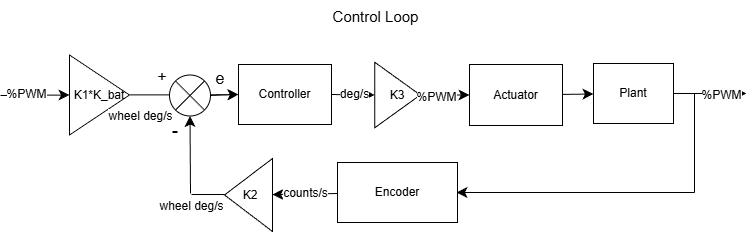

Control Loops Used
===================
This project utilizes Proportional-Integral control for adjusting motor speed, line following, and position tracking. All of these controllers use the same basic structure and are implemented as objects into the main program. These Class definitions are contained in the file controller.py.

Control Loop Diagram
----------------------

Motor Controllers
~~~~~~~~~~~~~~~~~~~
The left and right motors take a speed in mm/s as a setpoint and output a PWM percentage for the motors. The values K1 and K2 are constants that convert between units, and are the same for both the left and right controllers. K1 converts between mm/s and wheel-degrees/s; this value is 1.637. K2 converts between encoder-ticks/s and wheel-degrees/s; this value is 0.25. The constant K3 is a conversion from linear speed to PWM percentage; we set this value for each motor based on the results of a series of step response tests, detailed below.

Line Follow Controller
~~~~~~~~~~~~~~~~~~~~~~~
The line follow controller takes a target centroid location of the black values of the sensor array (which is 0 for the center), and computes an error in mm. In the IR_sensor task, this error is scaled into a wheel-speed difference in mm/s. This controller follows the same control loop structure shown above, but K1 and K2 are 1, since there are no unit conversions necessary. K3 can be used as an intermediate scaling factor, but we ended up setting it to 1 and scaling in the IR_sensor task instead to avoid controller error saturation issues. The Battery Voltage gain is also not present in this loop. Although this controller can use integral control, we found that it worked best without integral control, so Ki is set to 0.

Position Controller
~~~~~~~~~~~~~~~~~~~~~~~~~~~
The position controller takes a target angle difference in radians and computes an error in radians. In the PositionControl task, this error is scaled into a wheel-speed difference in mm/s. This controller follows the same control loop structure shown above, but K1 and K2 are 1, since there are no unit conversions necessary. K3 can be used as an intermediate scaling factor, but we ended up setting it to 1 and scaling in the PositionControl task instead to avoid controller error saturation issues. The Battery Voltage gain is also not present in this loop.

Tuning Approach
----------------
Proportional and Integral Gains
~~~~~~~~~~~~~~~~~~~~~~~~~~~~~~~~
We took a "trial and error" approach to finding Kp and Ki values. We started with no integral error, setting Ki to 0 and Kp to 1. We then iteratively scaled Kp, then worked to scale Ki. The final values of Kp and Ki are tabluated below.

.. list-table:: Proportional and Integral Gains
   :header-rows: 1
   :widths: 35 15 15

   * - Controller
     - Kp
     - Ki

   * - cl_ctrl_mot_left (CLMotorController)
     - 0.5
     - 3.8

   * - cl_ctrl_mot_right (CLMotorController)
     - 0.5
     - 3.8

   * - ir_controller (IRController)
     - 1.3
     - 0

   * - position_controller (PositionController)
     - 1
     - 1

K3 Gain for Motor Controllers
~~~~~~~~~~~~~~~~~~~~~~~~~~~~~~
In the motor controllers, K3 scales the controller output from a speed in wheel-degrees/s (which is the unit error calculation is performed in within the control loop) to an output PWM for the motors. Since the electrical components in the left and right motors are not exactly the same due to tolerancing, we wanted to experimentally get a relationship between measured encoder speed and motor effort. To do this, we performed 10 step response tests, where we set both motors to a PWM % effort between 10 and 100 for 3 seconds and recorded the encoder speed data. We did this while Romi drove on the floor since we wanted accurate speed performance while driving. Then, we found the steady-state speeds of each motor at each effort level, and then found a best-fit line. We converted the units of this line's slope (encoder-counts/s vs PWM %) to our desired scaling factor (PWM % vs wheel-degrees/s) to find the K3 value for each motor. This value was 0.06687 for the left motor, and 0.06841 for the right motor. Due to an issue we discovered with our encoder's timer initialization, we redid these step responses while developing our state estimator; csv files and the plotting programs used to generate the plots are found in the folder "Fixed Step Responses" witihn our Final Term Project folder on the GitHub Repository.

Step Response Results
~~~~~~~~~~~~~~~~~~~~~

.. list-table:: Step Response and Steady-State Behavior
   :header-rows: 1
   :widths: 50 50

   * - Left Motor  
       Step Response and Steady-State
     - Right Motor  
       Step Response and Steady-State

   * - .. image:: _static/Left_motor_stepResponse.png
          :alt: Left motor step response
          :align: center
          :width: 100%

        .. image:: _static/Left_motor_steady-statePlot.png
          :alt: Left motor steady-state velocity vs effort
          :align: center
          :width: 100%

     - .. image:: _static/Right_motor_stepResponse.png
          :alt: Right motor step response
          :align: center
          :width: 100%

        .. image:: _static/Right_motor_steady-statePlot.png
          :alt: Right motor steady-state velocity vs effort
          :align: center
          :width: 100%

Scaling Factors for wheel_speed_diff
~~~~~~~~~~~~~~~~~~~~~~~~~~~~~~~~~~~~~
For the Line Follow and Position controllers, the controller output was scaled into a wheel speed difference during the IR_sensor task and PositionControl task. This wheel speed difference was then used to adjust the setpoints of the left and right motor controllers in the left and right operations tasks. We also found these scaling factors based on trial and error, but with an informed estimate based on the speed we ran Romi at. For the Line follower controller, we started with a scaling factor of 100, since we were running Romi at speeds around 150-300 mm/s on the course. After experimenting, we decided on 70 as a scaling factor. For the Position controller, we settled on a scaling factor of -5, to align our output with our desired turn direction and to scale slightly. Keeping this value low made smaller angle adjustments possible.

