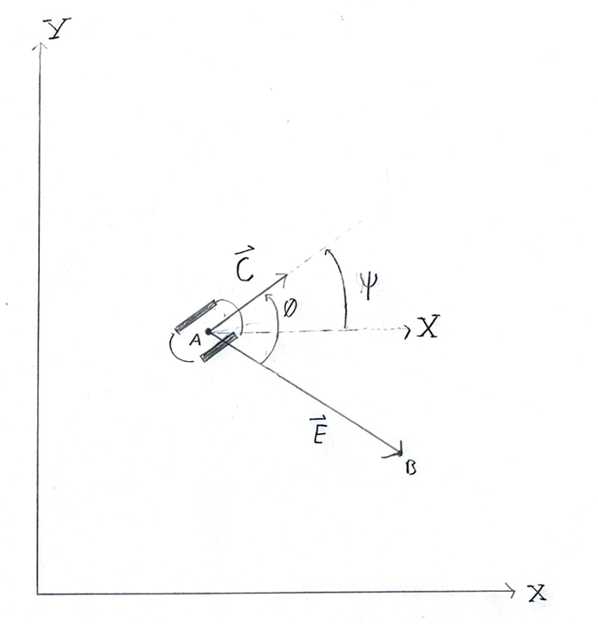

Tools Used for Navigation Control
==================================

Command Object
---------------

Due to the variety of pathing and operation modes used in the traversal of the game board, a standardized Command object was created to allow for easy modification and expansion Romi’s path. This implementation of navigation control allowed us to break the game board into discrete segments without creating separate states for each segment in our finite state machine. Instead, the command task is able to parse several command objects in only two states of a finite state machine, one to interpret the object, and one to check for an end condition.

A user-defined list of Command objects is created during initialization. The Commander task iterates through the list and parses each command object to issue commands to the left_ops, right_ops, PositionControl, and IR_sensor tasks. Due to the simple nature of the operational modes, these tasks operate autonomously without intervention from the Commander task until a user-specified end condition, which varies based on the operational mode, is reached. After a Command’s end condition is reached, the next Command object in the list is parsed and implemented. The mode of operation is a three-character-long string, which the Commander task uses to select flags to set for other tasks.

Though the end_condition argument is positional and is used for all modes of operation, the specific interpretation is different for each mode. These descriptions can be found on the page for the Command object. The Commander task performs no check on the end_condition argument, so the user must ensure that the correct value for the mode is set during the creation of the Command objects.

Aside from the positional arguments, the position following mode, “pos”, requires a set of coordinates to use as the target location. The coordinates are treated as optional arguments during object creation, but should be input by the user. 

The different modes and end conditions used by the command task are tabulated below:

Command End Conditions
~~~~~~~~~~~~~~~~~~~~~~~

.. list-table:: End Conditions by Command Mode
   :header-rows: 1
   :widths: 20 30 50

   * - Mode
     - Meaning
     - End Condition

   * - ``lin`` (Line Follow)
     - Robot follows a line using IR sensors and controller.
     - Command ends when the robot has traveled the specified **linear distance** (in mm).

   * - ``pos`` (Position Follow)
     - Robot moves toward a target global coordinate (X, Y).
     - Command ends when **distance to target position** ≤ end_condition threshold (mm).

   * - ``fwd`` (Forward Motion)
     - Blind forward drive (no line or position control).
     - Command ends after traveling a specified **forward linear distance** (in mm).

   * - ``rev`` (Reverse Motion)
     - Blind reverse drive.
     - Command ends after traveling the specified **reverse distance** (in mm).

   * - ``tip`` (Turn In Place)
     - Robot rotates about its center using IMU yaw measurement.
     - Command ends when **absolute yaw error** ≤ end_condition (radians).

   * - ``bmp`` (Bump Sensor Mode)
     - Robot drives until bump sensors detect contact.
     - Command ends when **bump sensor activates** (binary condition).

Global Coordinates
-------------------
The position of the robot in global coordinates is determined based on the angle of heading Ψ, which is directly read from the IMU, and the variable s, which corresponds to the total linear distance travelled by Romi’s center. s cannot be measured directly but is instead produced at each timestep using the discrete state estimator, which runs during the state_estimation task. Ψ and s comprise the 3rd and 4th values respectively of the model’s state vector, which is  implemented in the program as the field variable x_hat_new. 
Since the state estimator runs so quickly relative to Romi’s dynamics, it is reasonable to assume that over the duration of a single estimator evaluation,  which in this case is 50 milliseconds, any path taken by Romi can be approximated as a straight line segment in the direction of the heading angle. The length of this segment is measured as the change in s over the timestep.  Based on this assumption, the change in Romi’s position in global coordinates can be calculated by projecting the line segment onto the global axes using the angle of heading. Using this method for position calculation, the immediate position of Romi is known at every timestep, and the global position can be used to control behavior.

Line Following
---------------
Line Following occurs during the IR_sensor task, and uses the IR_sensor control object. Our line follower works by calculating the distance the centroid of black values read from the IR sensor array is from the center of the sensor array, returning a distance in mm. This distance is then scaled into a wheel speed difference by a factor of 70; we tuned this value from trial and error. The wheel speed difference is fed back into the left and right motor controllers' setpoints during the left and right operations tasks, with the scaled speed difference as an inter-task share.

For course navigation, the IR sensor controller can be enabled or disabled, effectively turning line following off and on. Line following mode is one of the modes parsed by the command object.

Position Controller
--------------------

Similarly to the line-following controller, the position controller works by calculating a desired difference between wheel speeds based on deviation from a setpoint. Ideally, the setpoint in this case would be the desired angle of heading of the robot, denoted by the variable Ψ, but due to the properties of the measurement coming from the sensor, the difference between the real and desired angle of heading is the controlled variable, and the setpoint is always zero. The IMU, which is solely responsible for producing yaw readings, reports the angle of heading as an integer between 0 and 2π, so simply subtracting angles will not always yield the correct result. Rather than solving for different cases dependent on the immediate value of Ψ, the angle between vectors, denoted Θ, is calculated from the vectors C and E.  

For the vector E, the magnitude is the distance between points A and B. The vector C can be broken into components along the global X and Y axes by taking the cosine and sine respectively of the angle Ψ. This yields a unit vector in the direction of the robot’s heading. The angle Θ is equal to the inverse cosine of the dot product of vectors C and E divided by the product of their magnitudes. Based on this calculation, the magnitude of the angle Θ can be determined, but not whether its pointing from C to E or vice versa.

The sign of the angle Θ can be determined based on the sign of the Z component of the cross product of C and E. In the actual implementation, only that component is calculated before being applied to the magnitude of Θ.

This calculation is performed entirely within the method yaw_error, which outputs the signed angle Θ and the magnitude of E. The signed angle Θ is fed to the controller as the input, and the controller’s setpoint is zero. 

The PositionController task repeatedly calculates the angle Θ, which demonstrably produces the desired result of moving Romi to a target location, but fails to stop it. Romi recognizes that it has reached its target position once the magnitude of the E vector is below some threshold distance. Effectively, this causes Romi to aim for a small circle around the target location. This distance-checking occurs in the Commander object.
