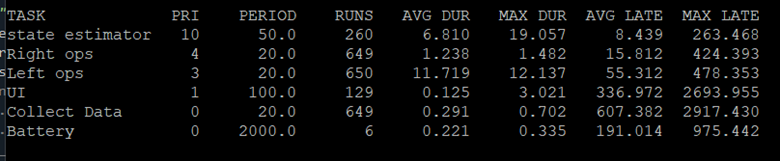
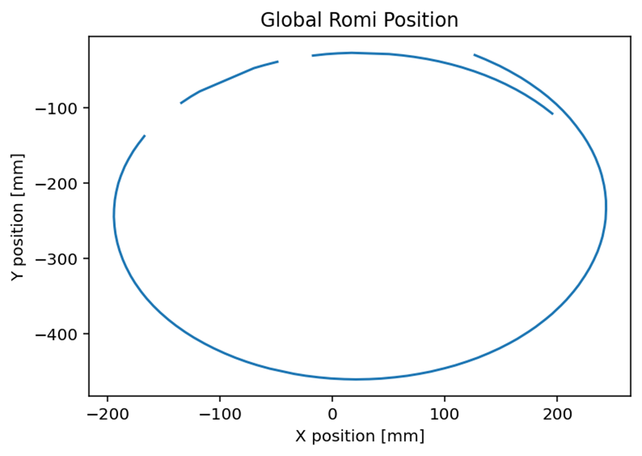
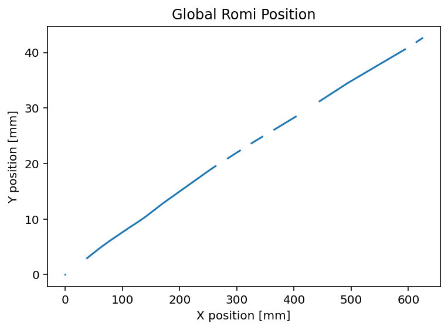

State Estimation
==================
This page details the development of the state estimator, which was developed and tested for reliability before beginning work on the obstacle course navigation.

Instead of relying on solely line-following to complete the obstacle course, Romi should be able to use other senses to optimally traverse to each checkpoint. Using the BNO055 inertial measurement unit allows us to know Romi’s position and base certain actions from a coordinate system of the course layout. The BNO055 uses three sensors to find angular acceleration (which reads gravitational force in the z-axis), angular velocity to track the 3D orientation of the IMU, and a compass to know its global orientation. Combining these senses will allow for Romi to always know its orientation in the course and should help smooth its trajectory through each obstacle. 

To complete the obstacle course, it is helpful for Romi to know its own absolute position so that it can move to a desired absolute location. An observer produces an estimate of a system’s state variables by combining a model’s expected output for a known input and feedback from the measurable states. From the state-space model of Romi below, the four state variables are the left and right wheel speeds in radians per second, Romi’s yaw angle in radians, and the linear distance travelled by Romi’s center. Of these, the wheel speeds and yaw angles are directly measurable from the encoders and IMU respectively. The only state variable that can’t be directly measured using one of the existing sensors is the linear distance travelled, so our initial goal was just to accurately predict it. Beyond that, we sought to produce estimates for the other state variables of greater accuracy than the pure sensor readings.

.. image:: _static/State_Space_Model.png
   :alt: Romi State space model
   :align: center
   :width: 75% 

Since the model’s initial conditions may be different from the true initial conditions, as measured by the sensors, the estimator must force the modeled outputs to converge to the sensor readings. This is done using feedback control with the error between the measured and modeled outputs, which is scaled by the L matrix. Initially, we created our L matrix by using MATLAB’s “place” function to find a set of gains that would cause the state-space system’s poles to be 5 times faster, which was decided arbitrarily. The original state-space system had only two poles, both of which were on the real axis, which gave an overdamped response, so our estimated output was consistently lagging the measured output in our testing. To resolve this issue, we sped up the system poles further by instead scaling them by a factor of ten. We also added a pair of underdamped poles that was closer to the origin than the real-axis poles so that the underdamped behavior would dominate the response, resulting in some overshoot and faster convergence. The script used to produce the discretized matrices, which are used in the estimation algorithm that runs in real-time on the board, can be found in the project repository.
 
Since our estimator runs at a very conservative timestep of 50 milliseconds, we decided to discretize our model to reduce error accumulation from a derivative-based solver like the Runge-Kutta solver. We discretized our model using MATLAB’s “c2d” function, which received the linear state-space system as a state-space object and the timestep in seconds. Instead of producing the derivative of the state variables at every timestep, the discrete model outputs the expected state variables at the next step, which avoids the potential undershoot and overshoot errors of the continuous model. We verified that the estimator was running at the desired rate by looking at the task profile, which is shown in Figure 1. The task profile shows that no runs were missed, since the ratios of the number of each run match with their task frequency, despite some tasks running late.

Figure 1: Task Profile

To confirm that our estimate of the linear distance travelled, s, was correct, we ran trials for both straight and curved paths. For the straight path trials, we placed a piece of tape next to the center of one of Romi’s wheels before commanding Romi to travel forward at a known speed for a known amount of time. After the time had elapsed, we recorded the estimated output and the position from the encoder. Then, we measured the actual distance travelled from the piece of tape using a yardstick. We found that increasing the gains in L by moving the desired poles further from the origin tended to produce more accurate estimates. Finally, when the estimated distance was consistently closer to the measured distance than the encoder’s reported distance, we stopped changing our estimator, as some utility was demonstrated. For the curved path trials, we set the motors to run at different speeds and compared the estimator output to the average of the encoder position readings until it was closer to the expected arc length swept out by the center of the robot, which we determined using the expected circumference given the wheel speeds and the observed angle of the arc.

For the other states, we ultimately decided to look directly at the sensor readings, as they were consistently more accurate than the estimator output. Since s is the only state that can’t be directly measured, we decided to prioritize its estimate over that of the other state variables. Additionally, since the gains in L were already so large, the measured output was already weighted much more than the model output, so switching over to pure sensor readings wouldn’t be a major disadvantage compared to a functional estimator for the measurable states.

To measure Ψ, the angle of heading, we added a new sensor to Romi, the BNO055 Inertial Measurement Unit (IMU), which uses a gyroscope and accelerometer to calculate its orientation relative to its initial orientation. The Nucleo board interfaces with the BNO055 IMU using I2C protocol. The IMU driver allows an IMU object to be created using a pyb I2C controller object and the address of the IMU to be interfaced with. Operations like performing calibration and reading sensor values from the IMU were implemented as class methods for the IMU object. After the first successful calibration, we stored the calibration profile, which records the sensor’s measurement errors, as a text file on the board. During regular operation, the profile is automatically read from the text file and written to the IMU to avoid recalibration, which is time consuming. 

Since communication with the IMU only occurs within the state estimation task, which has a period of 50 milliseconds, we set the timeout parameter for the I2C bus object to be greater than the period to prevent the communication from freezing due to inactivity. The bus is initialized with the Nucleo board as the controller and the IMU as the peripheral. Only certain Nucleo pins can be used as the SCL and SDA lines for I2C communication, so the selected pins were recorded in our pin map.

Finally, we wanted to use our state readings to determine the position in X and Y coordinates of Romi on the map. We accomplished this using the state variables Ψ and s. Since the timestep of 50 milliseconds is very fast compared to the speed at which Romi moves, the path that Romi takes within the timestep can be reasonably approximated as a straight line. Since Ψ and s are known, the distance that Romi travels and the absolute direction it moves are known, so the next position can be calculated and converted to global coordinates. This functionality is implemented within the state estimator task.

To confirm that position was being measured correctly, we commanded Romi to trace out a circle of a known diameter by setting the wheel speeds. While the circle was traced out, the global position was calculated and stored on Romi before finally being sent to a laptop over Bluetooth. Plotting these positions traced out the path we observed and the distances we expected, as can be seen in Figures 2. We also plotted our straight line test, which confirmed that Romi was traveling the expected distance, but also showed some drift off of a straight line of about 1mm per 16mm traveled. We confirmed through measurements with a yardstick that this drift is present, so the state estimator is accurate; this drift is an issue we expect to fix from more rigorous tuning of our motor controllers. These tests confirmed that our global position calculator was functional. 
 

Figure 2: Path of Romi tracing a circle of diameter 200 mm

Figure 3: Path of Romi traveling in a straight line of 600mm

Ultimately, our state estimator was useful because it allowed us to estimate the state variable s in real time, which was necessary for calculating global position. We used the distance traveled s to determine the end conditions of most of our pathing commands, and the X and Y global coordinates were used to develop our position controller.

