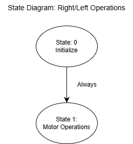
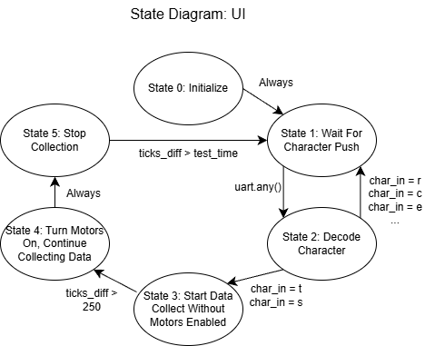
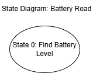
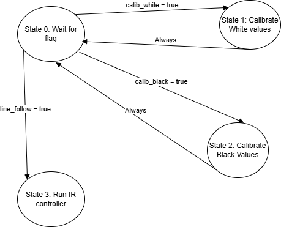
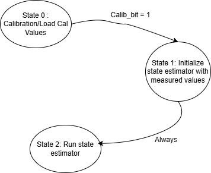
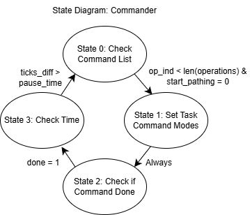
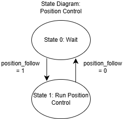

Mutlitasking Implementation
============================
The code for our project runs using a priority-based cooperative multitasking structure. We used the open source cotask.py to create tasks and run them in a task scheduler. Each task references a generator function in our main.pyb file that is loaded onto the MCU. In general, each task is implemented as a finite state machine, although some of our tasks align with this structure more closely than others.

Priorities and periods for tasks were chosen to have tasks run as quickly as possible without being late, or otherwise interfering with the other tasks. Avoiding blocking code is very important to do this. The state estimator task has the highest priority since we need it to check the end conditions for our course navigation. The left and right operations tasks have the second highest priorities, since these tasks run the motor and encoder drivers, as well as the control loops to adjust wheel speed. The UI task has a priority of 1 to help it run when a command is sent over uart, and the rest of the tasks have a priority of 0. 

Inter-task communication
-------------------------
Information is communicated between tasks using Share and Queue objects from the open source taskshare.py. A Queue is made of a series of Shares. Shares are defined as a certain data type, and information of that data type is stored in the share object and can be referenced in other tasks. Below is a tabulated version of all of the shares we used. In general, we used uint16 shares for true/false flags and data that would only count in positive whole numbers (such as encoder counts). For other shares where decimal values were needed or desired, float was used. We used Queue objects within our data collection task, but not for inter-task communication.

List of shares
~~~~~~~~~~~~~~
.. list-table::
   :widths: 20 10 10 60
   :header-rows: 1

   * - Variable
     - Type
     - Size
     - Description
   * - L_lin_spd
     - f
     - 32-bit float
     - Left motor linear speed setpoint (mm/s)
   * - L_voltage_share
     - f
     - 32-bit float
     - Left motor effective voltage (V)
   * - L_en_share
     - H
     - 16-bit unsigned
     - Left encoder count
   * - L_pos_share
     - f
     - 32-bit float
     - Left wheel position (encoder counts)
   * - L_vel_share
     - f
     - 32-bit float
     - Left wheel velocity (counts/s)
   * - L_time_share
     - H
     - 16-bit unsigned
     - Timestamp (µs)
   * - R_dir_share
     - H
     - 16-bit unsigned
     - Right motor direction
   * - R_lin_spd
     - f
     - 32-bit float
     - Right wheel linear speed setpoint (mm/s)
   * - R_voltage_share
     - f
     - 32-bit float
     - Right motor effective voltage (V)
   * - R_en_share
     - H
     - 16-bit unsigned
     - Right encoder count
   * - R_pos_share
     - f
     - 32-bit float
     - Right wheel position
   * - R_vel_share
     - f
     - 32-bit float
     - Right wheel velocity
   * - R_time_share
     - H
     - 16-bit unsigned
     - Timestamp (µs)
   * - run
     - H
     - 16-bit unsigned
     - Global run flag
   * - print_out
     - H
     - 16-bit unsigned
     - Debug print flag
   * - bat_share
     - f
     - 32-bit float
     - Battery voltage
   * - bat_flag
     - H
     - 16-bit unsigned
     - Low battery flag
   * - calib_black
     - H
     - 16-bit unsigned
     - Black calibration value
   * - calib_white
     - H
     - 16-bit unsigned
     - White calibration value
   * - line_follow
     - H
     - 16-bit unsigned
     - Line follower enable
   * - position_follow
     - H
     - 16-bit unsigned
     - Position follower enable
   * - wheel_diff
     - f
     - 32-bit float
     - Wheel speed difference
   * - yaw_angle_share
     - f
     - 32-bit float
     - IMU yaw angle
   * - yaw_rate_share
     - f
     - 32-bit float
     - IMU yaw rate
   * - dist_traveled_share
     - f
     - 32-bit float
     - Integrated forward distance
   * - IMU_time_share
     - H
     - 16-bit unsigned
     - IMU timestamp
   * - time_start_share
     - H
     - 16-bit unsigned
     - Motion segment start timestamp
   * - X_coords_share
     - f
     - 32-bit float
     - Current global X position
   * - Y_coords_share
     - f
     - 32-bit float
     - C

Task Diagram
-------------

.. image:: /_static/Task_Diagram.drawio.png
   :alt: Labeled Romi assembly - top
   :width: 700px
   :align: center

Inter-task shares are shown as dashed lines

List of Tasks
--------------
.. list-table::
   :widths: 15 20 10 10 45
   :header-rows: 1

   * - Task Name
     - Generator Function in main.py
     - Priority
     - Period (ms)
     - Shares Used

   * - Left ops
     - left_ops()
     - 3
     - 20
     - L_lin_spd, L_en_share, L_pos_share, L_vel_share, L_time_share, wheel_diff, line_follow, L_voltage_share, position_follow

   * - Right ops
     - right_ops()
     - 4
     - 20
     - R_lin_spd, R_en_share, R_pos_share, R_vel_share, R_time_share, wheel_diff, line_follow, R_voltage_share, position_follow

   * - UI
     - run_UI()
     - 1
     - 100
     - L_lin_spd, R_lin_spd, run, print_out, time_start_share, start_pathing

   * - Battery
     - battery_read()
     - 0
     - 2000
     - bat_share, bat_flag

   * - IR sensor
     - IR_sensor()
     - 0
     - 50
     - calib_black, calib_white, line_follow, L_lin_spd, R_lin_spd, wheel_diff

   * - state estimator
     - IMU_OP()
     - 10
     - 50
     - L_pos_share, R_pos_share, L_voltage_share, R_voltage_share, L_vel_share, R_vel_share, yaw_angle_share, yaw_rate_share, dist_traveled_share, IMU_time_share, time_start_share, X_coords_share, Y_coords_share

   * - Commander
     - commander()
     - 0
     - 20
     - X_coords_share, Y_coords_share, start_pathing, position_follow, line_follow, X_target, Y_target, dist_from_target, dist_traveled_share, R_lin_spd, L_lin_spd

   * - Pos CTRL
     - PositionControl()
     - 0
     - 20
     - X_coords_share, Y_coords_share, position_follow, IMU_time_share, yaw_angle_share, wheel_diff, dist_from_target, X_target, Y_target

Descriptions and Finite State Machines
--------------------------------------
Left and Right Ops Task
~~~~~~~~~~~~~~~~~~~~~~~

The left_ops and right_ops tasks implement the low-level closed-loop wheel control.
Each task reads its wheel encoder, computes velocity, runs a PI controller
(CLMotorController) to track the requested linear speed, applies any speed
difference from the line/position followers via `wheel_diff`, and writes the
resulting PWM effort, motor voltage estimate, encoder position, velocity, and
timing information to shared variables.

UI Task
~~~~~~~

The run_UI task handles the Bluetooth UART user interface. It initializes the
UI state, listens for incoming characters, and interprets the command `m` to
set the `start_pathing` flag, which tells the commander task to begin running
the pre-defined command sequence. Additional states are reserved for step
response testing and data collection control.

Battery Read Task
~~~~~~~~~~~~~~~~~

The battery_read task periodically samples the battery voltage using ADC
(BAT_READ), converts the raw reading to actual pack voltage using the voltage
divider ratio, and publishes it to a shared variable. It also updates each
motor controller with the current battery level and asserts a low-battery flag
when the voltage drops below the controller threshold.

IR Sensor Task
~~~~~~~~~~~~~~

The IR_sensor task manages the IR line sensor array and the line-following
controller. It supports black and white calibration modes, and in normal
operation it reads the sensor array, computes the line centroid, and feeds that
error into the IRController. The controller output is scaled and written to
`wheel_diff`, which the wheel tasks use to adjust left and right speeds for
line following when `line_follow` is enabled.

State Estimator Task
~~~~~~~~~~~~~~~~~~~~

The IMU_OP task acts as a combined IMU calibrator and state estimator. It first
calibrates the BNO055 IMU or loads stored calibration coefficients, then
continuously runs a discrete-time observer that fuses motor voltages, encoder
positions, and IMU measurements. It outputs yaw angle, yaw rate, estimated
distance traveled, and global (x, y) position to shared variables that other
tasks (such as PositionControl and commander) rely on.

Commander Task
~~~~~~~~~~~~~~

The commander task sequences a list of Command objects that define the robot’s
course navigation. For each command it configures the appropriate mode
(line-following, position-follow, blind forward motion, turn-in-place, or
bumper), sets speed and target shares, and then monitors progress using encoder
distance, position error, or yaw difference until the end condition is met. It
also enforces pause times between commands and provides a safety override using
the bump sensors.

Position Controller Task
~~~~~~~~~~~~~~~~~~~~~~~~

The PositionControl task implements a higher-level heading controller that
steers the robot toward a target waypoint. When `position_follow` is enabled,
it computes the yaw error and distance to the current (X_target, Y_target)
using the estimated global position and IMU yaw, runs the PositionController to
generate a steering command, and writes a scaled speed difference into
`wheel_diff`. It also updates `dist_from_target` so the commander can detect
when a position-based command has been completed.

